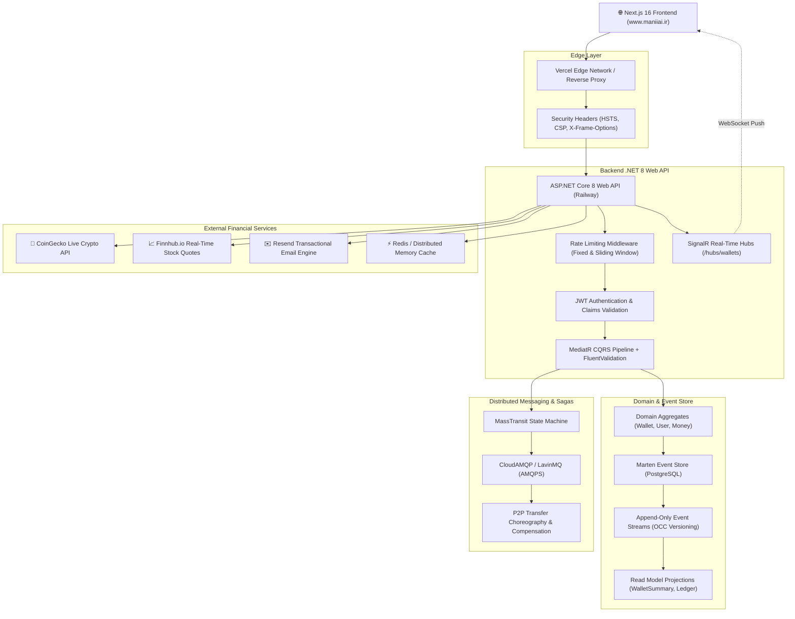

# 💎 NeoWallet — Enterprise Distributed Event-Sourced Fintech Platform

[](https://www.maniiai.ir)
[](https://dotnet.microsoft.com/)
[](https://martendb.io/)
[](https://masstransit.io/)
[-brightgreen?style=for-the-badge&logo=githubactions)](https://github.com/syyNcgoD/neowallet)
[](https://owasp.org/)

An enterprise-grade, distributed multi-currency digital wallet and financial management system built with **.NET 8 Clean Architecture**, **CQRS**, **Event Sourcing (Marten & PostgreSQL)**, **MassTransit Distributed Sagas (RabbitMQ)**, **Real-Time SignalR WebSockets**, and live financial market data integration (**CoinGecko & Finnhub.io**).

---

## 🌐 Live Production Deployment

- 🚀 **Official Production Domain:** **[https://www.maniiai.ir](https://www.maniiai.ir)**
- ⚡ **Vercel Edge Mirror:** **[https://frontend-khaki-eta-q0o1goip7w.vercel.app](https://frontend-khaki-eta-q0o1goip7w.vercel.app)**
- 🏦 **Cloud Backend API (Railway):** `https://neowallet-production.up.railway.app`

> 💡 **Frontend Attribution & UI Foundation:**  
> The frontend UI design system is built using **Next.js 16 (Turbopack)**, **React 19**, **Tailwind CSS 4**, and **Lucide Icons**, based on the open-source UI foundation by [Abderrahim Ghazali (shadcn-fintech)](https://github.com/abderrahimghazali/shadcn-fintech). It has been fully customized, refactored into a stateful client, and deeply integrated with the event-sourced .NET 8 backend, SignalR hubs, and real-time market data providers.

---

## 🏛️ System Architecture Overview



---

## 🧠 Codebase Knowledge Graph Analysis (via Graphify)

A comprehensive structural AST and dependency analysis of the codebase reveals:

- **2,439 Nodes** and **5,922 Edges** across **153 Architectural Communities**.
- **God Nodes (Core Domain Abstractions):**
  1. `NeoWallet.Domain.Common.Result<T>` — Functional Railway-Oriented Programming (ROP) result monad enforcing zero unhandled domain errors.
  2. `NeoWallet.Domain.ValueObjects.Money` — Immutable 128-bit fixed-point financial arithmetic avoiding floating-point rounding errors.
  3. `NeoWallet.Domain.Aggregates.Wallet` — Event-sourced root aggregate managing lifecycle, invariants, and currency consistency.
  4. `NeoWallet.Application.Common.Interfaces.IWalletReadService` — Decoupled query projection boundary.
  5. `NeoWallet.Infrastructure.Services.MarketService` — Concurrent parallel rate-limited financial market fetcher.

---

## 💎 Core Backend Engineering Highlights

### 1. Event Sourcing & Optimistic Concurrency Control (OCC)
- Every state change in a wallet is captured as an immutable domain event:
  - `WalletCreated`
  - `MoneyDeposited`
  - `MoneyWithdrawn`
  - `TransferInitiated` / `TransferCompleted` / `TransferFailed`
  - `WalletLocked` / `WalletUnlocked`
- **Zero Double-Spending Guarantee:** PostgreSQL Marten checks stream versions (`ExpectedVersion`) on every commit. If concurrent transactions attempt to debit the same wallet, Marten raises a `ConcurrencyException`, automatically rolling back the race condition.

### 2. Distributed Saga State Machine (MassTransit + CloudAMQP)
- Cross-wallet peer-to-peer transfers are executed as distributed sagas:
  1. **Initiation:** Debits source wallet and reserves funds.
  2. **Propagation:** Emits message over AMQPS broker (`CloudAMQP LavinMQ`).
  3. **Settlement:** Credits destination wallet upon receipt.
  4. **Compensation:** If target wallet is locked or invalid, compensating transactions automatically refund the source wallet with full audit trail.

### 3. Financial Precision & Value Objects
- Currency operations are encapsulated inside `Money` and `Currency` value objects:
  - Backed by 128-bit `decimal` data types.
  - Strict currency matching preventing cross-currency contamination without explicit exchange rate conversion.
  - Invariant guards rejecting zero or negative amounts (`!amount.IsPositive`).

### 4. Real-Time SignalR WebSockets
- Connected clients receive instant push updates:
  - `BalanceChanged` — Updates wallet balance across all open tabs.
  - `TransactionOccurred` — Prepends new entries to the live ledger without page refresh.
  - `SecurityAlert` — Broadcasts account lock/unlock status changes immediately.

### 5. Live Market Data Integration & Parallel Caching
- **CoinGecko API:** Fetches live crypto prices (BTC, ETH, SOL, XRP, ADA, DOGE, AVAX, LINK) with 15-second distributed cache.
- **Finnhub.io Stock API:** Concurrent multi-symbol queries (`Task.WhenAll`) for Wall Street equities (AAPL, NVDA, MSFT, TSLA, AMZN, GOOGL, META, V, NFLX, AMD, CRM, PYPL).
- **Resend Email API:** Sends transactional receipts and 2FA authentication codes.

---

## 🛡️ Security & Defensive Engineering Matrix

| Security Domain | Implementation Standard | Impact & Defense |
| :--- | :--- | :--- |
| **Password Hashing** | PBKDF2-SHA512 (100,000 rounds, 128-bit salt) | Immune to Rainbow Tables & GPU brute force; NIST SP 800-63B compliant |
| **Timing Attacks** | `CryptographicOperations.FixedTimeEquals` | Constant-time password hash verification |
| **Rate Limiting** | ASP.NET Core 8 `FixedWindow` & `SlidingWindow` | Auth limit: 15 req/min; Tx limit: 10 req/10s (HTTP 429 response) |
| **CORS Policy** | Strict Domain Whitelist | Restricted strictly to `maniiai.ir` and production Vercel domains |
| **Transport Security** | HSTS Preload (`max-age=31536000`, `includeSubDomains`) | Forces strict HTTPS encryption at all times |
| **Browser Defenses** | `X-Frame-Options: DENY`, `X-Content-Type-Options: nosniff` | 100% protection against Clickjacking and MIME sniffing |
| **Secrets Management** | Zero hardcoded keys; 100% environment variables | Pass GitHub Secret Scanning & Push Protection |

---

## 🧪 Automated Test Suite (252 / 252 Passing)

The solution includes a comprehensive, multi-layer automated test suite:

```bash
dotnet test --nologo
```

```
Test Run Summary:
----------------------------------------------------------------------
✓ NeoWallet.Domain.UnitTests             Passed: 152 / 152  (100%)
✓ NeoWallet.Application.UnitTests        Passed:  25 /  25  (100%)
✓ NeoWallet.Infrastructure.Integration   Passed:  60 /  60  (100%)
✓ NeoWallet.ArchitectureTests (ArchUnit) Passed:   5 /   5  (100%)
✓ NeoWallet.Api.IntegrationTests         Passed:  10 /  10  (100%)
----------------------------------------------------------------------
Total Tests: 252  |  Passed: 252  |  Failed: 0  |  Duration: ~18s
```

- **Domain Unit Tests:** Validates financial invariants, money math, wallet state transitions, and event emission.
- **Application Unit Tests:** Tests MediatR command handlers, query handlers, and FluentValidation rules.
- **Infrastructure Tests:** Tests Marten read models, Redis caching fallbacks, and password hashing.
- **Architecture Tests (ArchUnitNET):** Enforces strict Clean Architecture dependency boundaries (Domain has 0 external dependencies; Application depends only on Domain).
- **API Integration Tests:** End-to-end HTTP pipeline tests using `CustomWebApplicationFactory`.

---

## 📂 Project Structure

```
NeoWallet/
├── src/
│   ├── NeoWallet.Domain/            # Enterprise Business Rules & Event Sourced Aggregates
│   │   ├── Aggregates/              # Wallet, User, Transaction aggregates
│   │   ├── Events/                  # Immutable Domain Events
│   │   ├── ValueObjects/            # Money, Currency, Email, PasswordHash
│   │   └── Common/                  # AggregateRoot, Entity, Result<T> Monad
│   │
│   ├── NeoWallet.Application/       # Application Business Rules (CQRS & Sagas)
│   │   ├── Features/Wallets/        # Commands (Create, Deposit, Withdraw, Transfer, Lock)
│   │   ├── Features/Identity/       # Commands (Register, Login, 2FA, ApiKeys)
│   │   ├── DTOs/                    # Wallet, Market, Identity DTOs
│   │   └── Common/                  # Interfaces, Behaviors, Pipeline Validators
│   │
│   ├── NeoWallet.Infrastructure/    # External Services & Data Persistence
│   │   ├── Services/                # MarketService (CoinGecko/Finnhub), ResendEmailService
│   │   ├── Authentication/          # PasswordHasher (PBKDF2), JwtTokenGenerator
│   │   ├── ReadModels/              # Marten Projections & Query Services
│   │   └── DependencyInjection.cs   # MassTransit, Marten, Redis, HTTP Clients
│   │
│   └── NeoWallet.Api/               # ASP.NET Core 8 Web API & Host
│       ├── Controllers/             # WalletsController, AuthController, MarketController
│       ├── Hubs/                    # SignalR WalletHub WebSockets
│       ├── Middlewares/             # Security Headers, Rate Limiting, Exception Handling
│       └── Program.cs               # Pipeline Configuration & Startup
│
├── frontend/                        # Next.js 16 Frontend Web Application
│   ├── src/
│   │   ├── app/                     # App Router Pages (/dashboard, /investments, /crypto, ...)
│   │   ├── components/              # UI Components, Charts, Modals, Tables
│   │   ├── contexts/                # AuthContext, WalletContext
│   │   ├── hooks/                   # useUserWallets, useWalletTransactions, useDeposit
│   │   └── lib/api/                 # Axios Client with Auto-Refresh & Correlation ID
│   └── package.json
│
├── tests/                           # 5 Automated Test Projects (252 Tests)
│   ├── NeoWallet.Domain.UnitTests
│   ├── NeoWallet.Application.UnitTests
│   ├── NeoWallet.Infrastructure.IntegrationTests
│   ├── NeoWallet.ArchitectureTests
│   └── NeoWallet.Api.IntegrationTests
│
├── Dockerfile                       # Multi-stage optimized production build
├── docker-compose.yml               # Local development stack (Postgres, RabbitMQ, Redis)
└── README.md
```

---

## ⚙️ Environment Configuration

To run the project locally or in production, configure the following environment variables:

```env
# ASP.NET Core
ASPNETCORE_ENVIRONMENT=Production
PORT=8080

# Database (PostgreSQL Marten Event Store)
DATABASE_URL=postgresql://<DB_USER>:<DB_PASSWORD>@<DB_HOST>:5432/<DB_NAME>

# JWT Authentication
Jwt__Secret=<YOUR_SUPER_SECRET_JWT_SIGNING_KEY_MIN_32_CHARS>
Jwt__Issuer=NeoWallet
Jwt__Audience=NeoWallet

# Message Broker (RabbitMQ / CloudAMQP)
CLOUDAMQP_URL=amqps://<USER>:<PASS>@<HOST>/<VHOST>

# External Financial Market APIs
COINGECKO_API_KEY=<YOUR_COINGECKO_API_KEY>
FINNHUB_API_KEY=<YOUR_FINNHUB_API_KEY>

# Transactional Email Engine
RESEND_API_KEY=<YOUR_RESEND_API_KEY>
```

---

## 🚀 Getting Started Locally

### Prerequisites
- [.NET 8 SDK](https://dotnet.microsoft.com/download/dotnet/8.0)
- [Node.js 20+](https://nodejs.org/) & [pnpm](https://pnpm.io/)
- [Docker & Docker Compose](https://www.docker.com/)

### 1. Clone the repository
```bash
git clone https://github.com/syyNcgoD/neowallet.git
cd neowallet
```

### 2. Start Infrastructure via Docker Compose
```bash
docker-compose up -d
```

### 3. Run Backend Web API
```bash
dotnet run --project src/NeoWallet.Api
```

### 4. Run Frontend Application
```bash
cd frontend
pnpm install
pnpm dev
```

Visit `http://localhost:3000` to interact with your local NeoWallet instance!

---

## 📄 License

This project is open-source under the [MIT License](LICENSE).